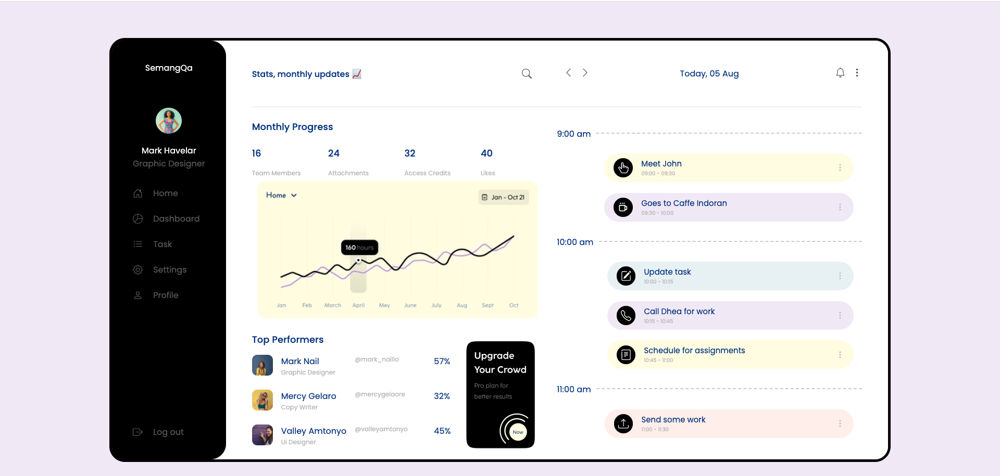
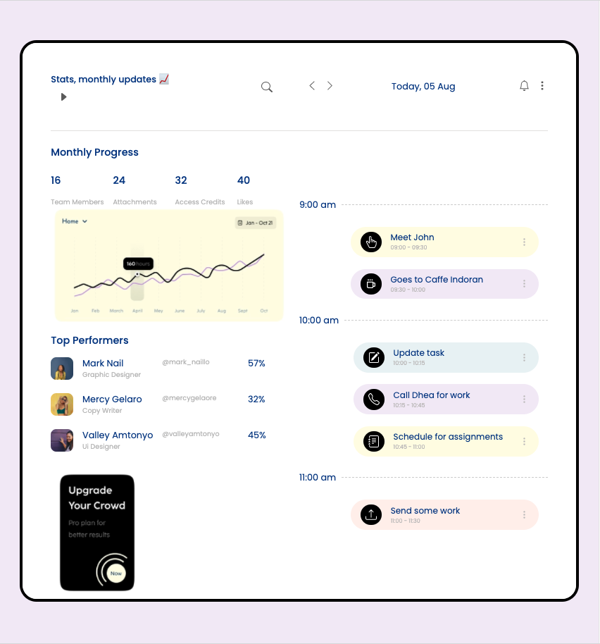
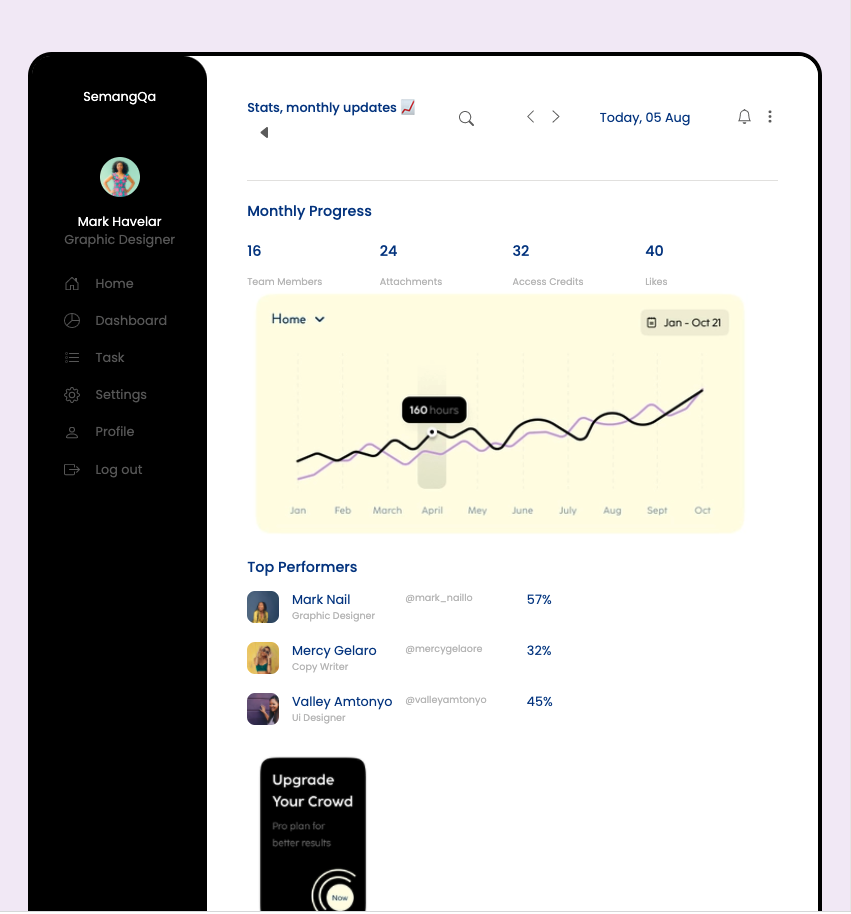
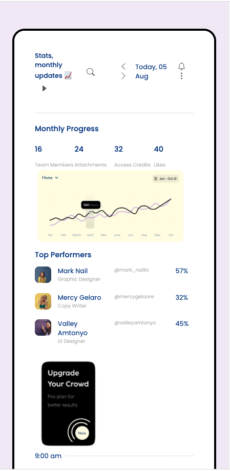

# Set up the interface

- Clone or download the app from [my github link](https://github.com/sunmengyue/unotest)

- Open the unotest directory and run `npm install` in the terminal

# Responsiveness

- Large Screen
  

- Medium Screen
  

- Expand Sidebar
  

- Small Screen
  
